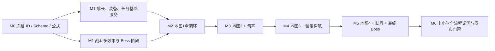

# 《昆吾禁地》0.1 内容依赖与验收矩阵（草案）

版本：0.1-draft.2  
日期：2026-08-04  
状态：用于策划评审与实施拆分，不直接覆盖现有 PRD

## 1. 文档事实源边界

| 内容 | 本草案组内事实源 |
|---|---|
| 版本范围、十小时节奏、地图与职业摘要 | `15_0.1版本完整策划案_草案.md` |
| 等级花费、突破材料、七维、HP 与战斗公式 | `16_0.1成长经济与战斗数值_草案.md` |
| 技能的伤害、冷却、状态与 AI | `17_0.1职业技能数值_草案.md` |
| 装备属性、特效、配方、来源与推荐组合 | `18_0.1装备与掉落数值_草案.md` |
| 敌人、精英、Boss 属性和阶段机制 | `19_0.1敌人与Boss战斗数值_草案.md` |
| 主线 NPC、对话、选项、旗标和汇流 | `20_0.1主线任务详细剧本_草案.md` |
| 支线 NPC、对话、不可逆选择和奖励 | `21_0.1支线任务详细剧本_草案.md` |
| 坐标、固定对象、首次奖励、商店与回访 | `22_0.1四图固定对象与经济清单_草案.md` |

冲突解决顺序为：用户新确认 > 对应详细分册 > 总案摘要。评审通过前不将草案数值直接视为现有实现值。

## 2. 0.1 实施基线与必要扩展

| 领域 | 现有基线 | 0.1 必须扩展 | 不可退让的边界 |
|---|---|---|---|
| 修士成长 | `HeroInstance` 已保存等级、境界、职业、七维和 HP | 保存历史职业段、筑基技能组、技能熟练境界和自动策略，支持炼气→筑基分支→结丹精通 | 筑基后技能 ID 与机制锁定；结丹只增强数值；旧等级不能被当前职业成长率倒算 |
| 战斗 | 单目标、单状态和基础伤害已有 | 多目标、同技能多效果、独立 DoT 回合、护盾、群体恢复、自吸血、嘲讽、反击、冻结、斩杀、飞行标签、Boss 阶段 | 0.1 无战斗净化；仍保持 `CombatCommand → 结算器 → CombatEvent → 表现层` |
| 地图 | D0 单图小范围、固定对象和探索存档已有 | 四个 bundle、异形可行走蒙版、碰撞/遮挡多边形、锁/短捷径、采集点重生、副本层、地图条件显示 | 领域层只使用 `GridCoord`；像素换算和遮挡淡化留在表现层 |
| 任务 | 仅有 `storyFlags: Record<string, boolean>` | 任务实例、当前节点、枚举/计数变量、可见目标、奖励领取幂等 | 选项只能调用任务命令，对话 UI 不直接改背包、地图或战斗真相 |
| 装备 | 背包只是物品计数 | 实例化装备、四槽位、职业限制、唯一装备获取、配装对比、打造原子扣除 | 武器职业专用；防具与饰品通用；两饰品不允许同 ID |
| 经济 | 基础资源钱包已有 | 商店轮转库、保底槽、回购、配方解锁、突破材料清单 | 主线材料只能丢失到可恢复位置；不得出售或分解致软锁 |
| 存档 | Schema v8 已有主档、备份与迁移 | 新 Schema 保存任务、职业历史、装备实例、Boss 阶段外的持久结果、商店保底和结局记录 | 重要命令原子保存；迁移只追加，不修改历史迁移 |

## 3. 建议数据资产与稳定 ID

### 3.1 数据表清单

| 数据集 | 核心字段 | 条数/覆盖 | 来源分册 |
|---|---|---:|---|
| `level_costs` | `from_level, to_level, soul_crystal, cumulative` | 29 | 16 |
| `breakthroughs` | `career_path_id, realm_id, level, wallet_costs, item_costs, trial_id, stat_bonus` | 16（8 筑基+8 结丹） | 16 |
| `career_growth_segments` | `career_id, min_level, max_level, growth_milli[7]` | 20 | 16 |
| `skills_01` | `skill_id, target, damage_kind, interval, cooldown, base_scaling[], mastery_scaling[], effects[], ai_tags` | 36（炼气过渡 12 + 筑基锁定 24） | 17 |
| `equipment_01` | `item_id, slot, allowed_careers, stats[7], hp, secondary, effects[], unique` | 44 | 18 |
| `recipes_01` | `recipe_id, result, unlock_flag, wallet_costs, item_costs` | 44 或按分册中可打造项实际生成 | 18 |
| `enemies_01` | `enemy_id, level, race_tags, hp, stats[7], skill_ids, loot_table` | 34 个模板 | 19 |
| `encounters_01` | `encounter_id, members[], formation, reward, escape_rule` | 按 22 的固定敌群逐个建立 | 19、22 |
| `quests_01` | `quest_id, start_condition, nodes[], terminal_states, rewards` | 5 条任务链 | 20、21 |
| `dialogues_01` | `dialogue_id, speaker_id, text_key, choices[], next` | 逐场景拆分 | 20、21 |
| `maps_01` | `map_id, bounds, walkable_mask, collision_mask, occluders[], entry, terrain, objects[], exits[]` | 4 | 15、22 |
| `shops_01` | `shop_id, unlocks[], guaranteed_slots[], prices, buyback_rate` | 1 家营地商店 | 22 |

此处数量是制作预算，不是要求将所有数据塞进单个 JSON。实施时应按 bundle 和引用关系拆分，并由 Schema 做跨表引用校验。

### 3.2 稳定 ID 命名

| 类型 | 格式 | 例子 |
|---|---|---|
| 主线链/节点 | `mq_kunwu_01` / `mq_01_m1_03` | `mq_01_m4_07` |
| 支线链/节点 | `sq_01_ledger` / `sq_01_q1_03` | `sq_04_q4_04` |
| 对话 | `dlg_<quest>_<scene>_<serial>` | `dlg_mq_m2_05_03` |
| 地图对象 | `<map_id>.<kind>_<serial>` | `map_03.elite_04` |
| 遭遇 | `enc_<map>_<role>_<serial>` | `enc_m4_boss_01` |
| 敌人/技能 | `enemy_<name>` / `skill_<line>_<name>` | `enemy_silver_wing_avatar` |
| 装备/配方 | `eq_m<map>_<slot>_<name>` / `rcp_<equipment_id>` | `eq_m4_weapon_jian` |
| 故事旗标 | `<scope>_<fact>` | `mq_ye_evidence`, `sq3_tablet_returned` |

所有 ID 使用英文小写蛇形，不用中文显示名做逻辑判断。授权名和原创替代名只替换本地化键的文本，不替换存档 ID。
玩家始终使用稳定 ID `player_seal_bearer`；对话框显示存档中的现用名。现用名不是旧姓名线索，改名不会改变
`identity_clues`、继任权限或任何任务判断。

## 4. 任务状态机与命令

### 4.1 节点状态

`LOCKED → AVAILABLE → ACTIVE → READY_TO_TURN_IN → COMPLETED`；只有被剧本明确放弃的子分支进入 `FAILED`。
主线不能进入无恢复路径的 `FAILED`。任务奖励使用 `reward_claim_id`幂等发放，重连或重复点击不重复给予。

### 4.2 可执行命令

| 命令 | 校验 | 原子结果 |
|---|---|---|
| `StartQuest` | 前置 Flag、地图解锁、未已完成 | 任务实例进入 ACTIVE |
| `ChooseDialogueOption` | 对话和选项可见、代价足够 | 扣除代价、写变量、推进节点 |
| `InteractMapObject` | 对象状态、道具、七维、任务节点 | 消耗/奖励、对象状态、事件全部同步落档 |
| `CompleteEncounter` | 战斗结果与 encounter ID 匹配 | 结算魂晶/掉落、对象、任务计数 |
| `ClaimQuestReward` | 节点完成且 claim ID 未使用 | 发放后标记幂等键 |
| `PerformBreakthrough` | 等级、试炼、路线、魂晶和材料都满足 | 扣除全部成本、追加 career segment、发放属性 |
| `CraftEquipment` | 配方、材料、唯一性、背包容量 | 一次性扣材料并生成装备实例 |

### 4.3 变量类型

- 布尔 Flag：是否取得证据、是否修复枢纽、NPC 是否存活、玩家身份是否揭晓。
- 枚举：元牌归属、五鬼袋处理、叶观衡结局、封链方案、玩家对旧身份的记录选择。
- 整数：`cen_trust`、`mu_trust`、`ye_evidence`、`seal_integrity`、`demonic_taint`、只增不减的`identity_clues`阶段、已修复枢纽数、已完成遗愿数。
- 集合：已读碑文、已获得阵图片、已击败的五鬼成员、已触发结丹对话的修士。

`storyFlags: Record<string, boolean>` 无法安全表示后三类，实施时应建独立 `QuestState`，不用多个布尔键拼出整数和枚举。

## 5. 页面与信息反馈最小集

| 页面/组件 | 必须展示 | 关键交互 |
|---|---|---|
| 任务追踪条 | 当前目标、距离/地图、条件进度 | 点击打开详情；不强制自动寻路 |
| 身份档案 | 现用名、掌印权限、已获得身份线索、已确认事实与未解疑点 | “总印为何认我”常驻为长期问题；地图4揭晓后分开显示已回答/未回答内容 |
| 对话面板 | 立绘、说话人、全文、选项、代价/检定、不可逆标识 | 不可逆选项二次确认；检定前显示属性与阈值 |
| 修士详情 | 七维、HP、灵根、境界、职业路径、3 技能、熟练境界和自动策略 | 筑基预览显示两分支定位、成长与技能组；结丹预览只显示同技能的`【精通】`数值增量 |
| 突破面板 | 等级门槛、试炼、每一项材料、魂晶和突破后七维 | 材料不足可点击追踪确定性来源 |
| 装备面板 | 四槽、七维/二级属性变化、特效、职业限制 | 换装前后对比；不允许相同饰品重复装备 |
| 入山整备 | 队员、灵息、灵粮、负重、地图建议战力/境界 | 出发前警告灵粮不足、死亡队员、结丹门槛 |
| 探索 HUD | 灵粮、灵息、临时战利品、任务目标、目标对象图标 | 可随时查看已打开短捷径与安全归营路线 |
| 战斗 HUD | 行动条、状态图标层数/时长、Boss 阶段条件、敌人飞行/魔性等标签 | 手动技能目标、自动策略切换、暂停查看机制 |
| 失败报告 | 阵亡原因、受伤占比、被控时长、中断次数、推荐调整 | 一键回到配装/技能策略；明示本次丢失 |

竖屏布局一律以 `375×817` 为唯一玩家可见设计基准。

## 6. 存档、失败与防卡死

### 6.1 存档必须保存

1. 修士当前数值、历史成长段、转职选择、锁定的筑基技能 ID、`skillProficiency`和自动策略。
2. 装备实例、穿戴关系、配方解锁、唯一物获得记录。
3. 任务节点、布尔/枚举/整数/集合变量、奖励幂等键；包括玩家现用名、`identity_clues`、
   `identity_revealed`和`identity_record_choice`。
4. 每图探索格、一次对象、短捷径、采集点冷却、副本进度和 Boss 首杀。
5. 营地商店保底购买、回购队列、结局类型与通关时间。

### 6.2 原子存档点

- 对话不可逆选项确认后。
- 完成战斗结算、开宝箱、交任务、打造、买卖、突破、装备更换后。
- 开启/关闭短捷径、进出副本、安全归营后。
- Boss 战内不保存阶段 HP；异常退出后回到战前存档，不复制消耗品也不保留战斗奖励。

### 6.3 必须通过的死锁用例

| 情形 | 恢复规则 |
|---|---|
| 主线突破材料在全队阵亡时丢失 | 回到原固定对象，或由岑守一通过一次性恢复命令补发 |
| 误卖普通打造材料 | 商店回购队列保留最近 20 笔，原价回购 |
| 魂晶花空、无法达成结丹门槛 | 固定副本和未清支线提供足量差额；若全清仍不足，开启无战力门槛的营地委托 |
| 选择魔道支线后污染过高 | 改变结局与部分 Boss 机制，但不封死主线入口 |
| 缺少支线证据 | 降低可选对话/结局评价，不阻断地图 4 Boss |
| 灵粮断绝时站在封闭副本 | 保留“立即弃山”命令，按阵亡损失结算并回营 |

## 7. 制作依赖与里程碑

| 里程碑 | 完成定义 |
|---|---|
| M0 内容冻结 | 本草案组通过评审；同名、同 ID、同数值的跨表引用无冲突 |
| M1 横向系统 | 四人可升级/筑基转职/结丹精通/换装；任务选项可存读；36 个技能及基础/精通两档数值都能由领域层表达 |
| M2 地图 1 | 从新档到石灵首杀可完成，返回营地后奖励、旗标和短捷径正确 |
| M3 地图 2 | 四人可走任一筑基分支；尸将与支线汇流可分别通过 |
| M4 地图 3 | 多部位 Boss、四条装备路线和两条中后期支线不互锁 |
| M5 地图 4 | 四人全员结丹是最终 Boss 的硬门槛；三种结局评价均可到达 |
| M6 发布候选 | 首通中位数 9–11 小时；无主线死锁；断网可全程玩；存档可恢复 |

## 8. 内容与系统验收矩阵

| 用户要求 | 可交付证据 | 可量化验收 |
|---|---|---|
| 约 10 小时 | 总案时间表、魂晶投放、地图固定对象 | 首次玩、阅读大部分对话且完成 2–4 支线的 P50 为 9–11 小时，P90 不超过 14 小时 |
| 4 张大地图 | 15、22 | 每图有唯一风格、尺寸、主环/支路、敌群、资源、事件、副本、Boss 和回访点 |
| 4 职业至结丹 | 15–17 | 四名固定修士均可 Lv1→30；Lv10 二选一筑基并锁定 3 个主动技能；Lv20 沿原支线结丹且技能 ID 不变，只进入`【精通】`数值 |
| 明确升级与突破成本 | 16 | Lv1→30 共 29 个逐级成本；每条筑基/结丹路线的条件、材料、魂晶、七维收益无空值 |
| 精确技能与状态 | 17 | 36 个技能都能从表格唯一计算基础/精通两档的目标、伤害/治疗、冷却、状态强度和持续时间；任一分支始终恰有 3 个主动技能 |
| 每图 1 套、每职业 4 档装备 | 18 | 4 种专属武器×4 档；通用防具/饰品可支撑所有分支；每件属性、特效、来源和成本完整 |
| 4 个 Boss，结丹才能通过第 4 个 | 19、20 | 每图恰 1 Boss；地图 4 入战时四人均需 `realm >= jiedan`，且结丹只提升既有技能数值；可根据阶段规则完整复现战斗 |
| 主线曲折、有 NPC/对话/选项/分支 | 20 | 30 个场景均有明确触发和台词/演出；“我是谁”在序章提出、前三图递进、地图4强制揭晓；有意义的冲突节点才给选项，关键证据不封死主线 |
| 4 条同等详细支线 | 21 | 每条至少 4 节点、一个不可逆选择、一个主线汇流效果和确定性奖励 |
| 地图资源和经济不卡死 | 16、18、22 | 不随机刷新商店也能凑齐主线装备/突破材料；任一主线物品都有恢复路径 |

## 9. 数值与剧情交叉审计清单

实施前逐项勾选：

- [ ] 四人从 Lv1 逐级累加到 Lv30 的七维与 16 的检查点一致。
- [ ] 36 个技能的属性键、目标类型、状态 ID 存在；各筑基分支恰有 3 技能，结丹前后 `skill_id` 完全不变。
- [ ] 所有战斗减益均可自然结束或通过抵抗、恢复、护盾与机制打断应对，不存在战斗净化硬检查。
- [ ] 四图 `walkable_mask` 均形成异形轮廓；遮挡物有碰撞多边形、排序层和淡入淡出参数，不改变领域层格坐标。
- [ ] 装备推荐表中的每个物品 ID 均存在，且不违反槽位和职业限制。
- [ ] 固定敌群只引用 19 定义的敌人模板，首次奖励与掉落表不重复发放。
- [ ] 主支线所有 NPC、地图对象、道具、敌人和奖励 ID 可解析。
- [ ] 不做任何支线也会在地图4明确揭示玩家的旧队身份、幸存原因和营主权限来源；旧姓名与是否自愿被清楚列为后续疑点。
- [ ] 每个不可逆选择的后果在后续至少有一次可感知反馈，而非只写 Flag。
- [ ] 四份筑基丹/灵材包、四份凝金丹/雪灵水、全部凝丹专用资源和四份已选路线辅材都有确定来源及恢复路径。
- [ ] 最差合理路线（检定失败、不接可选奖励）仍能全员结丹并进入最终战。
- [ ] 最佳路线的额外奖励不会使最终 Boss 跳过核心阶段。
- [ ] 新档、地图内强退、战斗中强退、任务奖励时强退、旧存档迁移均有验收用例。
- [ ] 四人不同筑基组合至少覆盖 16 种，必须不存在唯一正解队伍。

## 10. 发布验收数据

不需联网上报才能发布，但建议在 `telemetry_local` 保存匿名本地记录，供测试者自愿导出：

| 事件 | 最小字段 | 用途 |
|---|---|---|
| `map_enter/map_return` | `map_id, play_seconds, level_band, grain_in/out` | 校验时长与灵粮压力 |
| `combat_end` | `encounter_id, win, duration, deaths, escape, damage_summary` | 查找数值墙与机制不可读 |
| `quest_choice` | `node_id, choice_id, visible_conditions` | 检查分支可理解性，不记录个人信息 |
| `breakthrough` | `hero_id, path_id, level, play_seconds` | 验证四人结丹节奏 |
| `equipment_change` | `hero_id, slot, old_id, new_id, encounter_context` | 识别无人使用的装备和唯一解 |
| `ending_reached` | `ending_id, play_seconds, side_quests, retries` | 验收十小时目标与结局分布 |

发布前至少完成 12 个全流程样本：4 个低练度、4 个熟悉同类游戏、4 个策划/开发人员。
不以开发者速通时长代替首玩时长。若 P50 超出 9–11 小时，优先调整路径、交互重复和战斗数量，而不是调高或调低魂晶增速来掩盖节奏问题。
