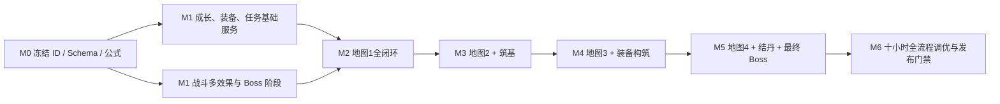

# 《昆吾禁地》1.0 内容依赖与验收矩阵（草案）

版本：1.0-draft.7  
日期：2026-08-05  
状态：用于策划评审与实施拆分，不直接覆盖现有 PRD

## 1. 文档事实源边界

| 内容 | 本草案组内事实源 |
|---|---|
| 版本范围、十小时节奏、地图与职业摘要 | `15_1.0版本完整策划案_草案.md` |
| 灵根倍率、等级花费、突破材料、七维、HP 与战斗公式 | `16_1.0成长经济与战斗数值_草案.md` |
| 技能的伤害、冷却、状态与 AI | `17_1.0职业技能数值_草案.md` |
| 装备品质、随机七维、特定效果、掉落、配方与重铸 | `18_1.0装备与掉落数值_草案.md` |
| 敌人、精英、Boss 属性和阶段机制 | `19_1.0敌人与Boss战斗数值_草案.md` |
| 主线与支线 NPC、对话、选项、旗标、奖励和汇流 | `剧情/20_1.0剧情任务详细剧本_草案.md` |
| 完整地图网络、前四图空间、路线、内容投放与回访 | `地图/27_完整游戏野外大地图与内容框架_草案.md`、`地图/28`–`31`详细地图文档 |
| 旧版坐标、固定对象、首次奖励与商店迁移参考 | `地图/22_1.0四图固定对象与经济清单_草案.md`；冲突以`27`–`31`为准 |
| 1.0两座主动资源副本、新修士追赶与长期Boss阵容克制 | `32_可重复资源副本与新修士追赶机制_草案.md` |
| 招贤馆、随机修士、候选刷新、馆级与遣散 | `15_1.0版本完整策划案_草案.md` §4.7；灵根倍率引用16 |

冲突解决顺序为：用户新确认 > 对应详细分册 > 总案摘要。评审通过前不将草案数值直接视为现有实现值。

## 2. 1.0 实施基线与必要扩展

| 领域 | 现有基线 | 1.0 必须扩展 | 不可退让的边界 |
|---|---|---|---|
| 修士成长 | `HeroInstance` 已保存灵根、等级、境界、职业、七维、HP 与阵亡状态 | 保存历史职业段、筑基技能组、技能熟练境界和自动策略，支持炼气→筑基分支→结丹精通 | 灵根同时缩放初始七维与升级成长；筑基后技能 ID 与机制锁定；结丹只增强数值；旧等级不能被当前职业成长率倒算 |
| 招贤馆 | 现有入口仅有锁定占位 | 候选批次、职业形象模板、灵根独立抽取、整点/付费刷新、招募改名、馆级1–9、名册容量与随机修士遣散 | 固定四人不可遣散；每批固定3人且不可锁定找回；付费刷新不改变整点；1.0不生成馆级10–24内容 |
| 战斗 | 单目标、单状态和基础伤害已有 | 多目标、同技能多效果、独立 DoT 回合、群体/单体恢复、自吸血、嘲讽、按实际承伤反伤、临时生命、限时召唤物、减速、眩晕、飞行标签、Boss 阶段 | 1.0 无战斗净化；仍保持 `CombatCommand → 结算器 → CombatEvent → 表现层` |
| 地图 | D0 单图小范围、固定对象和探索存档已有 | 四个 bundle、异形可行走蒙版、碰撞/遮挡多边形、锁/短捷径、采集点重生、副本层、地图条件显示 | 领域层只使用 `GridCoord`；像素换算和遮挡淡化留在表现层 |
| 任务 | 仅有 `storyFlags: Record<string, boolean>` | 任务实例、当前节点、枚举/计数变量、可见目标、奖励领取幂等 | 选项只能调用任务命令，对话 UI 不直接改背包、地图或战斗真相 |
| 装备 | 背包只是物品计数 | 实例化装备、五档品质、装备等级、随机种子、随机七维、特定效果、四槽位、职业限制、重复打造、重铸候选与配装对比 | 随机词条仅七维；通用槽位池限制不可突破；古宝不从普通来源掉落；两饰品不允许同 ID |
| 经济 | 基础资源钱包已有 | 商店轮转库、保底槽、回购、配方解锁、筑基灵石成本与降尘丹炼制链 | 主线材料只能丢失到可恢复位置；不得出售或分解致软锁 |
| 资源副本 | 无正式系统 | `map_03`回火矿窟、`map_04`镇魂残响、永久难度、首清捷径、快速重返、重复结算和失败恢复 | 可选主动挑战；无每日/体力/门票/扫荡；不挑战且不培养其他修士仍可通关主线 |
| 存档 | Schema v8 已有主档、备份与迁移 | 新 Schema 保存任务、职业历史、装备实例、Boss 阶段外的持久结果、商店保底和结局记录 | 重要命令原子保存；迁移只追加，不修改历史迁移 |

1.0不新增队伍挂机派遣、离线战斗收益或对应存档字段。`map_03`、`map_04`两座主动资源副本
正式进入1.0配置、挑战命令、结算事务、存档和验收；两者均不成为主线资源或阵容门槛。

## 3. 建议数据资产与稳定 ID

### 3.1 数据表清单

| 数据集 | 核心字段 | 条数/覆盖 | 来源分册 |
|---|---|---:|---|
| `spiritual_root_multipliers_01` | `spiritual_root_id, base_percent, growth_percent` | 6 | 16 |
| `hero_appearance_templates_01` | `template_id, career_id, visual_ref, base_stats[7], random_ranges[7], branch_bias` | 4职业×3模板 | 15 |
| `recruitment_hall_levels_01` | `level, hero_level_cap, max_realm_id, roster_capacity, wood_cost` | 1.0为1–9；长期结构24级 | 15 |
| `recruitment_template_weights_01` | `hall_level, career_id, template_weights[]` | 1.0馆级1–9 | 15 |
| `recruitment_root_weights_01` | `hall_level, spiritual_root_id, weight` | 1.0馆级1–9×6灵根 | 15、16 |
| `recruitment_costs_01` | `spiritual_root_id, recruit_stone_cost, refresh_stone_cost, rename_stone_cost` | 6档招募费＋全局刷新/改名费 | 15 |
| `level_costs` | `from_level, to_level, soul_crystal, cumulative` | 29 | 16 |
| `breakthroughs` | `career_path_id, realm_id, level, wallet_costs, item_costs, trial_id, stat_bonus` | 16（8 筑基+8 结丹） | 16 |
| `career_growth_segments` | `career_id, min_level, max_level, growth_milli[7]` | 20 | 16 |
| `skills_01` | `skill_id, target, damage_kind, interval, cooldown, base_scaling[], mastery_scaling[], effects[], ai_tags` | 36（炼气过渡 12 + 筑基锁定 24） | 17 |
| `equipment_quality_rules_01` | `quality, color, stat_count, budget_range, ordinary_drop_allowed` | 5 | 18 |
| `equipment_templates_01` | `template_id, slot, allowed_careers, allowed_stats[], weakened_stats, visuals` | 制式模板组+特定装备定义 | 18 |
| `equipment_specials_01` | `item_id, min_quality, equipment_level, fixed_effects[], stat_pool_override, unique_group` | 按分册特定装备表 | 18 |
| `equipment_loot_tables_01` | `source_kind, map_id, equipment_chance, quality_weights, level_range` | 四图普通/精英/Boss/宝箱 | 18 |
| `recipes_01` | `recipe_id, template_or_item, level_band, quality_rule, unlock_flag, wallet_costs, item_costs` | 制式档、特定装备及降尘丹配方 | 16、18 |
| `enemies_01` | `enemy_id, level, race_tags, hp, stats[7], skill_ids, loot_table` | 34 个模板 | 19 |
| `encounters_01` | `encounter_id, members[], formation, reward, escape_rule` | 按地图28–31职责与新版固定对象清单建立 | 19、地图28–31 |
| `quests_01` | `quest_id, start_condition, nodes[], terminal_states, rewards` | 5 条任务链 | 20 |
| `dialogues_01` | `dialogue_id, speaker_id, text_key, choices[], next` | 逐场景拆分 | 20 |
| `maps_01` | `map_id, bounds, walkable_mask, collision_mask, occluders[], entry, terrain, objects[], exits[]` | 4 | 地图27–31、新版固定对象清单 |
| `repeatable_dungeons_01` | `dungeon_id, parent_map_id, unlock_condition, shortcut_id, reward_kind, difficulty_ids[]` | 2 | 32、地图30–31 |
| `dungeon_difficulties_01` | `difficulty_id, dungeon_id, realm_band, recommended_power, encounter_ids[], first_reward, repeat_reward` | 两座副本的筑基/结丹永久难度 | 16、19、32 |
| `shops_01` | `shop_id, unlocks[], guaranteed_slots[], prices, buyback_rate` | 1 家营地商店 | 18；地图22仅作旧版迁移参考 |

此处数量是制作预算，不是要求将所有数据塞进单个 JSON。实施时应按 bundle 和引用关系拆分，并由 Schema 做跨表引用校验。

### 3.2 稳定 ID 命名

| 类型 | 格式 | 例子 |
|---|---|---|
| 主线链/节点 | `mq_kunwu_01` / `mq_01_m1_03` | `mq_01_m4_07` |
| 支线链/节点 | `sq_01_ledger` / `sq_01_q1_03` | `sq_04_q4_04` |
| 对话 | `dlg_<quest>_<scene>_<serial>` | `dlg_mq_m2_05_03` |
| 地图对象 | `<map_id>.<kind>_<serial>` | `map_03.elite_04` |
| 遭遇 | `enc_<map>_<role>_<serial>` | `enc_m4_boss_01` |
| 敌人/技能 | `enemy_<name>` / `skill_<line>_<name>` | `enemy_silver_wing_avatar` |
| 制式模板/特装/配方 | `eqtpl_<slot>_<name>` / 保留既有特装 ID / `rcp_<output_id>` | `eqtpl_armor_light` / `r04_space_bead` / `rcp_dustfall_pill` |
| 突破道具 | `item_breakthrough_<name>` | `item_breakthrough_dustfall_pill`（降尘丹） |
| 故事旗标 | `<scope>_<fact>` | `mq_ye_evidence`, `sq3_tablet_returned` |
| 修士模板/随机修士实例 | `hero_tpl_<career>_<serial>` / `hero_random_<uuid>` | `hero_tpl_five_elements_01` |
| 招贤候选批次/候选 | `recruit_batch_<hour_epoch>` / `<batch_id>_<slot>` | `recruit_batch_496032_02` |
| 资源副本/难度 | `rd_<map>_<name>` / `<dungeon_id>_<realm>` | `rd_map03_refire_mine` / `rd_map03_refire_mine_foundation` |

所有 ID 使用英文小写蛇形，不用中文显示名做逻辑判断。授权名和原创替代名只替换本地化键的文本，不替换存档 ID。
玩家始终使用稳定 ID `player_seal_bearer`；对话框显示存档中的现用名。现用名不是旧姓名线索，改名不会改变
`identity_clues`、继任权限或任何任务判断。

## 4. 任务状态机与命令

### 4.1 节点状态

`LOCKED → AVAILABLE → ACTIVE → READY_TO_TURN_IN → COMPLETED`；只有被剧本明确放弃的子分支进入 `FAILED`。
主线不能进入无恢复路径的 `FAILED`。任务奖励使用 `reward_claim_id`幂等发放，重连或重复点击不重复给予。

### 4.2 可执行命令

| 命令 | 校验 | 原子结果 |
|---|---|---|
| `StartQuest` | 前置 Flag、地图解锁、未已完成 | 任务实例进入 ACTIVE |
| `ChooseDialogueOption` | 对话和选项可见、代价足够 | 扣除代价、写变量、推进节点 |
| `InteractMapObject` | 对象状态、道具、七维、任务节点 | 消耗/奖励、对象状态、事件全部同步落档 |
| `CompleteEncounter` | 战斗结果与 encounter ID 匹配 | 结算魂晶/掉落、对象、任务计数 |
| `ClaimQuestReward` | 节点完成且 claim ID 未使用 | 发放后标记幂等键 |
| `PerformBreakthrough` | 等级、试炼、路线、灵石和对应境界道具满足；筑基 `item_costs` 为空 | 扣除全部成本、追加 career segment、发放属性 |
| `CraftItem` | 炼器坊已解锁、配方、材料和道具容量 | 原子扣除凝丹灵草与灵晶，固定产出降尘丹等非装备物品 |
| `CraftEquipment` | 配方、材料、等级档、品质规则和背包容量 | 一次性扣材料，以新随机种子生成装备实例 |
| `ReforgeEquipment` | 装备在营地、未锁定、无待选候选、材料足够 | 扣材料并保存新七维候选，等待新旧二选一 |
| `ResolveReforge` | 候选存在且未确认 | 原子保留旧七维或接受新七维，清除候选 |
| `EnsureRecruitmentBatch` | 招贤馆已开放；当前 UTC 整点批次与存档批次不一致 | 按当前小时种子生成3名新候选并使旧批次失效，不补发离线期间历史批次 |
| `RefreshRecruitmentBatch` | 招贤馆已开放、灵石足够、无进行中刷新事务 | 扣除刷新费并生成3名新候选；保留原`nextFreeRefreshAtUtc`不变 |
| `RecruitCandidate` | 候选属于当前批次、未被招募、名册未满、灵石足够 | 扣除按灵根计算的招募费，创建炼气Lv1修士实例并移除该候选 |
| `RenameHero` | 随机修士存在、名称合法；招募时免费名额或后续灵石足够 | 更新显示名；后续改名原子扣费，实例ID和任务状态不变 |
| `UpgradeRecruitmentHall` | 当前馆级<9、前置满足、灵木足够 | 原子扣除灵木并提升馆级，刷新等级上限、境界权限和名册容量 |
| `DismissRandomHero` | 非固定修士，未处于野外/任务/还魂占用，装备可退回仓库 | 退回装备与全部突破道具，返还累计升级魂晶80%向下取整，清理引用后删除实例 |
| `EnterRepeatableDungeon` | 副本已发现、难度已解锁、队伍合法且无其他活动入山 | 创建资源副本挑战快照并进入整备区；失败不扣未确认资源 |
| `CompleteRepeatableDungeon` | 挑战快照、难度、遭遇结果与可选条件一致，结算键未使用 | 原子发放首次/重复奖励、记录首清与捷径并清除挑战快照 |

### 4.3 变量类型

- 布尔 Flag：是否取得证据、是否修复枢纽、NPC 是否存活、玩家身份是否揭晓。
- 枚举：元牌归属、五鬼袋处理、叶观衡结局、封链方案、玩家对旧身份的记录选择。
- 整数：`cen_trust`、`mu_trust`、`ye_evidence`、`seal_integrity`、`demonic_taint`、只增不减的`identity_clues`阶段、已修复枢纽数、已完成遗愿数。
- 集合：已读碑文、已获得阵图片、已击败的五鬼成员、已触发结丹对话的修士。

`storyFlags: Record<string, boolean>` 无法安全表示后三类，实施时应建独立 `QuestState`，不用多个布尔键拼出整数和枚举。

## 5. 页面与信息反馈最小集

| 页面/组件 | 必须展示 | 关键交互 |
|---|---|---|
| 任务追踪条 | 当前目标、距离/地图、条件进度 | 点击打开详情；不强制自动寻路 |
| 身份档案 | 现用名、掌印权限、已获得身份线索、已确认事实与未解疑点 | “总印为何认我”常驻为长期问题；地图4揭晓后分开显示已回答/未回答内容 |
| 对话面板 | 立绘、说话人、全文、选项、代价/检定、不可逆标识 | 不可逆选项二次确认；检定前显示属性与阈值 |
| 修士详情 | 七维、HP、灵根、境界、职业路径、3 技能、熟练境界和自动策略 | 筑基预览显示两分支定位、成长与技能组；结丹预览只显示同技能的`【精通】`数值增量 |
| 招贤馆 | 馆级、等级上限、境界权限、名册容量、3名候选、距下次整点刷新时间、刷新费 | 候选显示职业/灵根/七维/成长预览；付费刷新、招募、招募时免费改名、后续改名和遣散确认 |
| 突破面板 | 等级门槛、试炼、灵石、结丹所需降尘丹和突破后七维 | 降尘丹不足可直接跳转炼器坊配方；筑基不显示材料栏 |
| 装备面板 | 四槽、装备等级、品质、随机七维、固定特效、职业限制、来源 | 换装前后对比；不允许相同饰品重复装备；重铸新旧结果二选一 |
| 入山整备 | 队员、灵息、灵粮、负重、地图建议战力/境界 | 出发前警告灵粮不足、死亡队员、结丹门槛 |
| 资源副本选择 | 已发现副本、永久难度、主产出、建议境界/战力、首清/重复状态 | 从地图入口或首清后的营地快捷入口进入；允许连续挑战和返回整备 |
| 探索 HUD | 灵粮、灵息、临时战利品、任务目标、目标对象图标 | 可随时查看已打开短捷径与安全归营路线 |
| 战斗 HUD | 行动条、状态图标层数/时长、Boss 阶段条件、敌人飞行/魔性等标签 | 手动技能目标、自动策略切换、暂停查看机制 |
| 失败报告 | 阵亡原因、受伤占比、被控时长、中断次数、推荐调整 | 一键回到配装/技能策略；明示本次丢失 |

竖屏布局一律以 `375×817` 为唯一玩家可见设计基准。

## 6. 存档、失败与防卡死

### 6.1 存档必须保存

1. 固定/随机来源、修士当前数值、形象模板、随机结果、历史成长段、转职选择、锁定的筑基
   技能 ID、`skillProficiency`、累计升级魂晶、历次突破道具成本和自动策略。
2. 装备实例、随机种子、最终七维、穿戴关系、配方解锁、特装任务进度和未确认的重铸候选。
3. 任务节点、布尔/枚举/整数/集合变量、奖励幂等键；包括玩家现用名、`identity_clues`、
   `identity_revealed`和`identity_record_choice`。
4. 每图探索格、一次对象、短捷径、采集点冷却、副本进度和 Boss 首杀。
5. 营地商店保底购买、回购队列、结局类型与通关时间。
6. 招贤馆等级、当前候选批次ID与种子、3个候选结果、已招募槽位、
   `nextFreeRefreshAtUtc`、名册容量和随机修士改名状态。
7. 两座资源副本的发现、各难度首清、永久捷径、最近挑战设置和进行中挑战快照；不保存按现实时间增长的收益。

### 6.2 原子存档点

- 对话不可逆选项确认后。
- 完成战斗结算、开宝箱、交任务、打造、重铸生成/确认、买卖、突破、装备更换后。
- 招贤馆自然换批、付费刷新、招募、改名、馆级升级和遣散后。
- 开启/关闭短捷径、进出副本、安全归营后。
- 资源副本首清、重复结算、连续挑战或退出整备区后。
- Boss 战内不保存阶段 HP；异常退出后回到战前存档，不复制消耗品也不保留战斗奖励。

### 6.3 必须通过的死锁用例

| 情形 | 恢复规则 |
|---|---|
| 主线突破材料在全队阵亡时丢失 | 回到原固定对象，或由岑守一通过一次性恢复命令补发 |
| 误卖普通打造材料 | 商店回购队列保留最近 20 笔，原价回购 |
| 魂晶花空、无法达成结丹门槛 | 固定副本和未清支线提供足量差额；若全清仍不足，开启无战力门槛的营地委托 |
| 选择魔道支线后污染过高 | 改变结局与部分 Boss 机制，但不封死主线入口 |
| 缺少支线证据 | 降低可选对话/结局评价，不阻断地图 4 Boss |
| 灵粮断绝时站在封闭副本 | 保留“立即弃山”命令，按阵亡损失结算并回营 |
| 付费刷新后立刻到整点 | 付费批次可被整点批次正常替换；刷新费不重复扣除，整点时间不因付费刷新顺延 |
| 遣散时仓库容量或保存失败 | 整笔操作回滚，装备、修士、突破道具和魂晶保持遣散前状态 |
| 0.1存档修士等级高于馆级上限 | 迁移时自动补至可容纳现有最高等级的最低馆级，不降级、不锁死 |

## 7. 制作依赖与里程碑

| 里程碑 | 完成定义 |
|---|---|
| M0 内容冻结 | 本草案组通过评审；同名、同 ID、同数值的跨表引用无冲突 |
| M1 横向系统 | 固定与随机修士可招募、升级、筑基转职、结丹精通、换装和安全遣散；招贤馆刷新与馆级可存读；36 个技能及基础/精通两档数值都能由领域层表达 |
| M2 地图 1 | 从新档到石灵首杀可完成，返回营地后奖励、旗标和短捷径正确 |
| M3 地图 2 | 四人可走任一筑基分支；尸将与支线汇流可分别通过 |
| M4 地图 3 | 多部位 Boss、珍品任务链、随机制式装备和两条中后期支线不互锁；回火矿窟可首清并重复挑战 |
| M5 地图 4 | 四人全员结丹是最终 Boss 的硬门槛；三种结局评价均可到达；镇魂残响可首清并重复挑战 |
| M6 发布候选 | 首通中位数 9–11 小时；无主线死锁；断网可全程玩；存档可恢复 |

## 8. 内容与系统验收矩阵

| 用户要求 | 可交付证据 | 可量化验收 |
|---|---|---|
| 约 10 小时 | 总案时间表、魂晶投放、地图固定对象 | 首次玩、阅读大部分对话且完成 2–4 支线的 P50 为 9–11 小时，P90 不超过 14 小时 |
| 4 张大地图 | 15、22 | 每图有唯一风格、尺寸、主环/支路、敌群、资源、事件、副本、Boss 和回访点 |
| 4 职业至结丹 | 15–17 | 四名固定修士均可 Lv1→30；Lv10 二选一筑基并锁定 3 个主动技能；Lv20 沿原支线结丹且技能 ID 不变，只进入`【精通】`数值 |
| 招贤馆补充修士 | 15、16 | 每批固定3人；模板和灵根独立抽取；整点24批/日；付费刷新不重置整点；馆级1–9限制全部修士；招募、改名、遣散返还均可原子恢复 |
| 2座主动资源副本 | 16、32、地图30–31 | 回火矿窟主产灵石、镇魂残响主产魂晶；首清后可快速重返；无每日、体力、门票、扫荡或离线收益 |
| 明确升级与突破成本 | 16 | Lv1→30 共 29 个逐级魂晶成本；筑基仅灵石300，结丹为灵石1200与降尘丹1，七维收益无空值 |
| 精确技能与状态 | 17 | 36 个技能都能从表格唯一计算基础/精通两档的目标、伤害/治疗、冷却、状态强度和持续时间；任一分支始终恰有 3 个主动技能 |
| 随机七维与高阶特装 | 18 | 制式装备只随机七维并遵守槽位池；地图1–2无紫装、普通来源无金装；特装固定效果但七维随机；重铸可安全二选一 |
| 4 个 Boss，结丹才能通过第 4 个 | 19、20 | 每图恰 1 Boss；地图 4 入战时四人均需 `realm >= jiedan`，且结丹只提升既有技能数值；可根据阶段规则完整复现战斗 |
| 主线曲折、有 NPC/对话/选项/分支 | 20 | 30 个场景均有明确触发和台词/演出；“我是谁”在序章提出、前三图递进、地图4强制揭晓；有意义的冲突节点才给选项，关键证据不封死主线 |
| 4 条同等详细支线 | 21 | 每条至少 4 节点、一个不可逆选择、一个主线汇流效果和确定性奖励 |
| 地图资源和经济不卡死 | 16、18、22 | 随机装备不作为主线门槛；不随机刷新商店也能凑齐突破材料和基础打造/重铸材料；任一主线物品都有恢复路径 |

## 9. 数值与剧情交叉审计清单

实施前逐项勾选：

- [ ] 四人从 Lv1 逐级累加到 Lv30 的七维与 16 的检查点一致。
- [ ] 36 个技能的属性键、目标类型、状态 ID 存在；各筑基分支恰有 3 技能，结丹前后 `skill_id` 完全不变。
- [ ] 所有战斗减益均可自然结束或通过抵抗、恢复、护盾与机制打断应对，不存在战斗净化硬检查。
- [ ] 四图 `walkable_mask` 均形成异形轮廓；遮挡物有碰撞多边形、排序层和淡入淡出参数，不改变领域层格坐标。
- [ ] 制式装备只生成七维；武器/饰品、玄甲、法衣、行衣分别满足允许池与削弱规则。
- [ ] 26 个旧普通装备 ID 只注册为制式模板，§5 特定装备 ID 只注册为特装定义；两池不重叠。
- [ ] 特定装备 ID、固定品质/等级、固定效果、任务来源与七维池覆盖均可解析；古宝不能由普通掉落、宝箱或商店生成。
- [ ] 重铸候选跨刷新保持不变，确认后不能再次选择、复制实例或退回已消耗材料。
- [ ] 固定敌群只引用 19 定义的敌人模板，首次奖励与掉落表不重复发放。
- [ ] 主支线所有 NPC、地图对象、道具、敌人和奖励 ID 可解析。
- [ ] 不做任何支线也会在地图4明确揭示玩家的旧队身份、幸存原因和营主权限来源；旧姓名与是否自愿被清楚列为后续疑点。
- [ ] 每个不可逆选择的后果在后续至少有一次可感知反馈，而非只写 Flag。
- [ ] 地图2固定提供四人筑基所需灵石1200；地图3固定解锁降尘丹配方，并提供四枚所需的凝丹灵草4、灵晶60和结丹灵石4800。
- [ ] 最差合理路线（检定失败、不接可选奖励）仍能全员结丹并进入最终战。
- [ ] 最佳路线的额外奖励不会使最终 Boss 跳过核心阶段。
- [ ] 新档、地图内强退、战斗中强退、任务奖励时强退、旧存档迁移均有验收用例。
- [ ] 四人不同筑基组合至少覆盖 16 种，必须不存在唯一正解队伍。
- [ ] 不招募其他修士且完全不挑战资源副本时，固定四人任一合理筑基组合仍可完成全部主线；前四章没有第五、第六人硬门槛。
- [ ] 两座资源副本的发现、首清、重复奖励、快速重返和连续挑战均可恢复；重复挑战不推进主线或复制唯一物。
- [ ] 招贤馆连续跨整点、离线跨多个整点和整点前付费刷新均只保留当前合法批次，不重复扣费或找回旧候选。
- [ ] 每馆级灵根权重总和合法，杂灵根始终高于90%、异灵根始终低于0.5%；模板权重不受灵根抽取结果影响。
- [ ] 馆级1–9的等级上限、境界权限和名册容量与总案一致；配置中不存在可进入的馆级10–24页面或命令。
- [ ] 随机修士遣散返还全部实际突破道具与累计升级魂晶80%向下取整，不返还灵石类费用；固定四人始终不可遣散。

## 10. 发布验收数据

不需联网上报才能发布，但建议在 `telemetry_local` 保存匿名本地记录，供测试者自愿导出：

| 事件 | 最小字段 | 用途 |
|---|---|---|
| `map_enter/map_return` | `map_id, play_seconds, level_band, grain_in/out` | 校验时长与灵粮压力 |
| `combat_end` | `encounter_id, win, duration, deaths, escape, damage_summary` | 查找数值墙与机制不可读 |
| `quest_choice` | `node_id, choice_id, visible_conditions` | 检查分支可理解性，不记录个人信息 |
| `breakthrough` | `hero_id, path_id, level, play_seconds` | 验证四人结丹节奏 |
| `equipment_change` | `hero_id, slot, old_id, new_id, encounter_context` | 识别无人使用的装备和唯一解 |
| `ending_reached` | `ending_id, play_seconds, side_quests, retries` | 验收十小时目标与结局分布 |

发布前至少完成 12 个全流程样本：4 个低练度、4 个熟悉同类游戏、4 个策划/开发人员。
不以开发者速通时长代替首玩时长。若 P50 超出 9–11 小时，优先调整路径、交互重复和战斗数量，而不是调高或调低魂晶增速来掩盖节奏问题。
